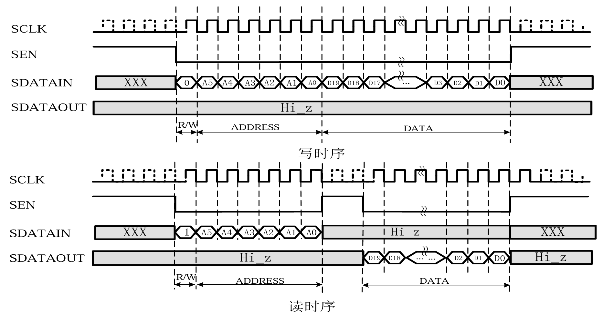
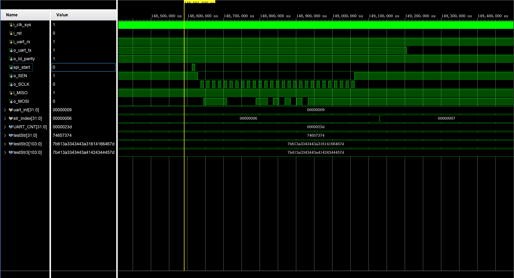

# SPI-master
A spi master module, driven by uart module.  
Receive uart signal from serial port.   
Then, send spi signals to Jt201D, a chip associated to satellite communications.

## Communication Timing
  
Obviously, CPOL is 0 and CPHA is 0
* ### write mode  
  Set SEN port low, and then send out SCLK signal to inform the slave module. MOSI needs to switch data at the negative edge of SCLK, and MISO needs to get data at the positive edge of SCLK.  
  When transfer is done, set SEN port high.  
    
  This mode will send out the address bits and data bits directly. 
* ### read mode  
  Set SEN port low, and then send out SCLK signal to inform the slave module. MOSI needs to switch data at the negative edge of SCLK, and MISO needs to get data at the positive edge of SCLK.  
  When transfer is done, set SEN port high.  
    
  This mode will send out the address bits first, and then end one transfer process. Keep SEN high for 2 cycles. Then, transfer the data bits(MOSI data is not important, just make sure MISO can return full data), slave module will return the target bits from its registers. 

## SPI master module
the SPI master module starts with a start signal: i_start.

In this project, i_start signal is enabled by uart module.  

## UART module
This module receives UART signals from serial ports. And will inform the SPI module according to the state machine.
# SPI-master
A spi master module, driven by uart module.  
Receive uart signal from serial port.   
Then, send spi signals to Jt201D, a chip associated to satellite communications.

## Communication Timing
  
Obviously, CPOL is 0 and CPHA is 0
* ### write mode  
  Set SEN port low, and then send out SCLK signal to inform the slave module. MOSI needs to switch data at the negative edge of SCLK, and MISO needs to get data at the positive edge of SCLK.  
  When transfer is done, set SEN port high.  
    
  This mode will send out the address bits and data bits directly. 
* ### read mode  
  Set SEN port low, and then send out SCLK signal to inform the slave module. MOSI needs to switch data at the negative edge of SCLK, and MISO needs to get data at the positive edge of SCLK.  
  When transfer is done, set SEN port high.  
    
  This mode will send out the address bits first, and then end one transfer process. Keep SEN high for 2 cycles. Then, transfer the data bits(MOSI data is not important, just make sure MISO can return full data), slave module will return the target bits from its registers. 

## SPI master module
the SPI master module starts with a start signal: i_start.

In this project, i_start signal is enabled by uart module.  

## UART module
This module receives UART signals from serial ports. And will inform the SPI module according to the state machine.

test
